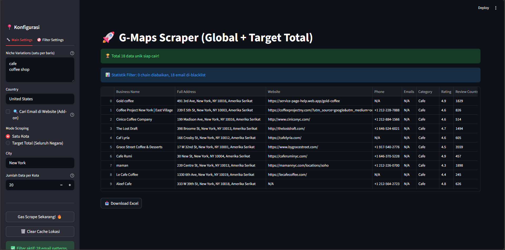
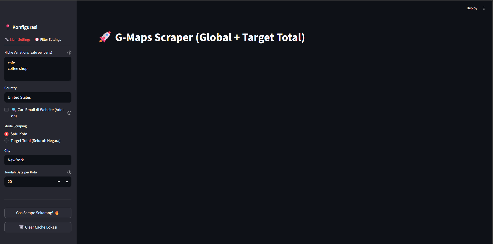

# 🚀 MScrape: Google Maps Scraper

Sebuah *tool* berbasis Python & Streamlit yang digunakan untuk mengambil (*scrape*) ribuan prospek/leads bisnis potensial dari Google Maps secara cepat dan otomatis. Didesain dengan antarmuka web (UI) agar mudah digunakan meski tanpa pengetahuan *coding*.

## 📸 Tampilan Aplikasi



Alat ini cocok untuk *B2B Lead Generation*, agensi *marketing*, pencarian data restoran/kafe, dan *cold outreach*.

## ✨ Fitur Utama
- **🌍 Scraping Global & Lokal**: Cari bisnis di kota manapun berdasarkan *niche*/kata kunci.
- **📍 Geolocation Cerdas**: Mendukung ekstraksi titik otomatis *(Geocoding via Nominatim)* untuk hasil pencarian yang sangat akurat.
- **🤖 Anti-Click Intercept & Tahan Banting**: Dirancang agar tahan terhadap perubahan tata letak antarmuka Google Maps dengan metode pencarian XPath berbasis *Aria-Label*.
- **📧 Ekstraksi Email Otomatis**: Bot akan mencoba mengunjungi masing-masing *website* bisnis dan memindai halaman tersebut untuk mendapatkan alamat email resmi mereka.
- **🛡️ Built-in Filter Blacklist**: Mengabaikan email spam (seperti `info@`, `noreply@`) atau bisnis korporat besar (seperti Starbucks, KFC). Semuanya dapat dikonfigurasi melalui antarmuka.
- **💾 Export to Excel**: Hasil akhir bisa didownload langsung dalam format `.xlsx` dengan rapi.

## 🆕 Apa yang Baru (Migrasi ke Playwright)
- **Kecepatan & Stabilitas:** *Scraper* kini menggunakan **Playwright** menggantikan Selenium. Playwright beroperasi jauh lebih cepat (tanpa memerlukan *ChromeDriver* eksternal) dan lebih andal menembus mekanisme *anti-bot* Google.
- **Dukungan Asynchronous di Windows:** Sudah dilengkapi penyesuaian khusus (`ProactorEventLoop`) agar tidak *crash* ketika dijalankan secara asinkron dari dalam *Streamlit* di OS Windows.
- **Pencarian Email Baru:** Ekstraksi email beroperasi di *tab* Playwright yang jauh lebih stabil dan efisien saat memindai isi *website*.

## 🛠️ Persyaratan Sistem
- Python 3.8 atau lebih baru
- Tidak perlu menginstal *ChromeDriver* lagi. Mesin *browser* internal (Chromium) akan diunduh secara otomatis pada saat dijalankan via `run.bat`.

## 🚀 Instalasi & Cara Penggunaan

1. **Clone repositori ini:**
   ```bash
   git clone https://github.com/Indra-cahya/MScrape.git
   cd MScrape
   ```

2. **Instal dependensi Python & Chromium:**
   Pastikan Anda menjalankan perintah ini untuk menginstal semua *library* dan *browser* bawaan Playwright.
   ```bash
   pip install -r requirements.txt
   playwright install chromium
   ```

3. **Jalankan Aplikasi:**
   Bagi pengguna Windows, Anda cukup klik dua kali pada file:
   **`run.bat`**

   Atau jalankan manual melalui terminal:
   ```bash
   cd GoogleMaps-Lead-Scraper
   streamlit run app.py
   ```

4. **Buka di Browser:**
   Aplikasi akan otomatis terbuka. Jika tidak, silakan kunjungi `http://localhost:8501`.

## ⚙️ Cara Pemakaian di Antarmuka
1. Masukkan kata kunci (Niche) pada panel sebelah kiri (contoh: `cafe`, `plumber`, `dentist`).
2. Tentukan asal Kota/Negara.
3. Centang fitur **Cari Email** jika Anda juga membutuhkan alamat email mereka (Proses akan sedikit lebih lama).
4. Tekan **"Gas Scrape Sekarang! 🔥"** dan tunggu hingga bar progres mencapai 100%.
5. *Download* hasilnya melalui tombol **Download Excel**.

## 📝 Catatan Penting
- Kecepatan internet dan kemampuan spesifikasi RAM sangat berpengaruh, mengingat *scraper* ini menggunakan *headless browser* (Selenium).
- Karena *update* Google Maps terus berjalan, tata letak dapat berubah sewaktu-waktu. Selalu periksa apakah ada *update* atau modifikasi versi terbaru dari kode pencarian `XPath` di repositori ini.

---

### Lisensi
Bebas untuk didistribusikan, dimodifikasi, dan dimanfaatkan secara open-source. Selalu gunakan *scraper* ini dengan etika dan hargai batas kebijakan privasi target bisnis yang Anda *scrape*.
